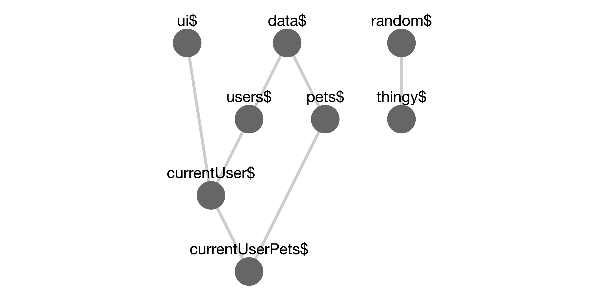

# Reselect Tools
[![Travis][build-badge]][build]
[![npm package][npm-badge]][npm]
[![Coveralls][coveralls-badge]][coveralls]

Tools for working with the [reselect](https://github.com/reactjs/reselect) library:
*Check selector dependencies, inputs, outputs, and recomputations at any time without refreshing!*


```js
// in selectors.js
import {
	createSelectorWithDependencies as createSelector
} from 'reselect-tools'


export const data$ = (state) => state.data;
export const ui$ = (state) => state.ui;
export const users$ = createSelector(data$, (data) => data.users);
export const currentUser$ = createSelector(ui$, users$, (ui, users) => users[ui.currentUser]);
...

// in configureStore.js
import * as selectors from './selectors.js'
import * as ReselectTools from 'reselect-tools'

ReselectTools.getStateWith(() => store.getState())  // allows you to get selector inputs and outputs
ReselectTools.registerSelectors(selectors) // register string names for selectors
...
ReselectTools.checkSelector('currentUser$')
=> {
	inputs: [{currentUser: 1}, users: {1: {name: 'sam'}}]
	outputs: {name: 'sam'},
	dependencies: [ui$, users$],
	recomputations: 1,
    isNamed: false,
    selectorName: 'currentUser$'
}
selectorGraph()
=> {
	nodes: {
		"data$": {
			name: "data$",
			recomputations: "N/A"
		},
		"ui$": {
			name: "ui$",
			recomputations: "N/A"
		},
		"users$": {
			name: "user$",
			recomputations: 1
		},
		"currentUser$": {
			name: "currentUser$",
			recomputations: 1
		},
	},
	edges: [
		{ from: users$, to: data$ },
		{ from: users$, to: data$ },
		{ from: currentUser$, to: users$ },
		{ from: currentUser$, to: ui$ },
	]
}
```

## Table of Contents

- [Motivation](#motivation)
- [Getting Started](#getting-started)
- [Example](#example)
- [API](#api)
  - [`createSelectorWithDependencies`](#createselectorwithdependenciesinputselectors--inputselectors-resultfunc)
  - [`getStateWith`](#getstatewithfunc)
  - [`checkSelector`](#checkselectorselector)
  - [`selectorGraph`](#selectorgraphselectorkey--defaultselectorkey)
  - [`registerSelectors`](#registorselectorskeyselectorobj)
- [License](#license)

## Motivation

It's handy to visualize the application state tree with the [Redux Devtools](https://github.com/zalmoxisus/redux-devtools-extension). But I was using selectors a lot, and there was no easy way to visualize the *computed state tree*. So, I created this library to output graphs like this one:



This library was intended to be used with the [chrome extension](https://github.com/skortchmark9/reselect-devtools-extension). However, it can be still be [useful without the chrome extension installed](#without-the-extension). The chrome extension will be useless without this library.

See the original reselect issue [here](https://github.com/reactjs/reselect/issues/279).

## Getting Started

Firstly, I apologize in advance that this section is required. It would be great to match the experience of installing redux devtools or react's. Hopefully the tools will be more tightly integrated with reselect at some point and these steps won't be necessary.

1. Install the Package

        npm install -s reselect-tools

2. Grab the [Chrome Extension](https://chrome.google.com/webstore/detail/reselect-devtools/cjmaipngmabglflfeepmdiffcijhjlbb)

3. Tracking Dependencies:

   Replace ```createSelector``` from reselect with ```createSelectorWithDependencies```! 
   ```
   import {
    	createSelectorWithDependencies as createSelector
   } from 'reselect-tools'
   ```

   That's it! At this point you should be able to open the devtools and view the selector graph. While the graph will be correct, it might be hard to understand what's going on without...

4. Naming Selectors:

   ```
   const foo$ = createSelectorWithDependencies(bar$, (foo) => foo + 1);
   foo$.selectorName = 'foo$' // selector while show up as 'foo'
   ```
   This can get tedious, so you might want to register your selectors all at once.
   ```
   import { registerSelectors } from 'reselect-tools'
   registerSelectors({ foo$, bar$ });
   ```
   Or if you're keeping all your selectors in the same place:
   ```
   import { registerSelectors } from 'reselect-tools'
   import * as selectors from './selectors.js'
   ReselectTools.registerSelectors(selectors)
   ```

   Now the graph should have nice names for your selectors.

5. Checking Selector Inputs and Outputs

   Imagine that your tests are passing, but you think some selector in your app might be receiving bad input from a depended-upon selector. Where in the chain is the problem? In order to allow ```checkSelector``` and by extension, the extension, to get this information, we need to give Reselect Tools some way of feeding state to a selector.
   ```
   import store from './configureStore'
   ReselectTools.getStateWith(() => store.getState())
   ```

## Example
    npm run example

## API

### createSelectorWithDependencies(...inputSelectors | [inputSelectors], resultFunc)

Calls down to Reselect's `createSelector`, but adds ```inputSelectors``` as an array of ```.dependencies``` on the returned selector.

```js
const vanillaSelector1 = state => state.values.value1
const vanillaSelector2 = state => state.values.value2
const mySelector = createSelectorWithDependencies(
  vanillaSelector1,
  vanillaSelector2,
  (value1, value2) => value1 + value2
)

mySelector.dependencies[0] // vanillaSelector1
mySelector.dependencies[1] // vanillaSelector2
```


### getStateWith(func)

`getStateWith` accepts a function which returns the current state. This state is then passed into ```checkSelector```. In most cases, this will be ```store.getState()```

### checkSelector(selector)

Outputs information about the selector at the given time.

By default, outputs only the recomputations of the selector.
If you use ```createSelectorWithDependencies```, it will also output the selector's dependencies.
If you use ```getStateWith```, it will output the selector's input and output values.
If you use ```registerSelectors```, you can pass it the string name of a selector.


```js
const two$ = () => 2;
const four$ = () => 4
const mySelector$ = createSelectorWithDependencies(two$, four$, (two, four) => two + four)
registerSelectors({ mySelector$ })
getStateWith(() => null)

checkSelector('mySelector$')  // {
									 inputs: [2, 4],
									 output: 6,
									 dependencies: [two$, four$],
									 recomputations: 1,
								 }
```


### selectorGraph(selectorKey = defaultSelectorKey)

```selectorGraph``` outputs a POJO with nodes and edges. A node is a selector in the tree, and an edge goes from a selector to the selectors it depends on.

```js
selectorGraph()
//  {
//  	nodes: {
//  		"data$": {
//  			name: "data$",
//  			recomputations: "N/A"
//  		},
//  		"ui$": {
//  			name: "ui$",
//  			recomputations: "N/A"
//  		},
//  		"users$": {
//  			name: "user$",
//  			recomputations: 1
//  		},
//  		"currentUser$": {
//  			name: "currentUser$",
//  			recomputations: 1
//  		},
//  	},
//  	edges: [
//  		{ from: users$, to: data$ },
//  		{ from: users$, to: data$ },
//  		{ from: currentUser$, to: users$ },
//  		{ from: currentUser$, to: ui$ },
//  	]
//  }
```

#### Using custom selectorKeys

Nodes in the graph are keyed by string names. The name is determined by the ```selectorKey``` function. This function takes a selector outputs a string which must be unique and consistent for a given selector. The ```defaultSelectorKey``` looks for a function name, then a match in the registry, and finally resorts to calling toString on the selector's ```resultFunc```.

See the [tests](test/test.js#L246) for an alternate selectorKey.


### registorSelectors(keySelectorObj)

Simple helper to set names on an object containing selector names as keys and selectors as values. Has the side effect of guaranteeing a selector is added to the graph (even if it was not created with ```createSelectorWithDependencies``` and no selector in the graph depends on it).

### Without The Extension

If you're using an unsupported browser, or aren't happy with the extension, you can still get at the data.

The dev tools bind to your app via this global:
```
  window.__RESELECT_TOOLS__ = {
    selectorGraph,
    checkSelector
  }
```
Even without the devtools, you can call ```__RESELECT_TOOLS__.checkSelector('mySelector$')``` from the developer console or ```__RESLECT_TOOLS__.selectorGraph()``` to see what's going on. If the JSON output of the graph is hard to parse, there's an example of how to create a visual selector graph [here](tests/your-app.js).


## License

MIT

[build-badge]: https://api.travis-ci.org/skortchmark9/reselect-tools.svg?branch=master
[build]: https://travis-ci.org/skortchmark9/reselect-tools

[npm-badge]: https://img.shields.io/npm/v/reselect-tools.svg?style=flat-square
[npm]: https://www.npmjs.org/package/reselect-tools

[coveralls-badge]: https://coveralls.io/repos/github/skortchmark9/reselect-tools/badge.svg?branch=master
[coveralls]: https://coveralls.io/github/skortchmark9/reselect-tools?branch=master
